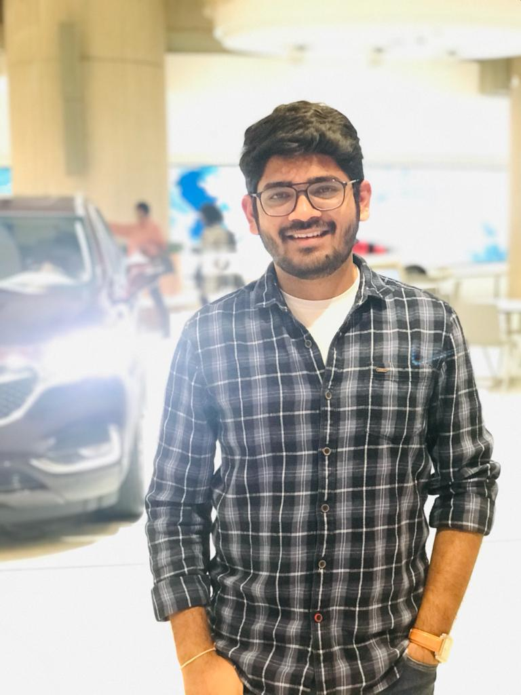

# Anil Bomma
## Current
I'm a member of the Fall 2019 batch working on my Masters of Applied Computer Science and will be graduating this December 2020.

## Background
I'm born & brought from Hyderabad, India, completed an undergraduate in Electrical & Communication department in the year 2016.  Since I'm not from CS background spent most of my time understanding programming concepts. I've had 4+ years of work experience in the IT industry as a full-stack developer. I use to have a pretty ordinary lifestyle.

## Plans
I want to see my self as a full-stack developer with a piece of good knowledge as a cloud engineer.

## Links
GitHub: [https://github.com/anil-bomma](https://github.com/anil-bomma)

